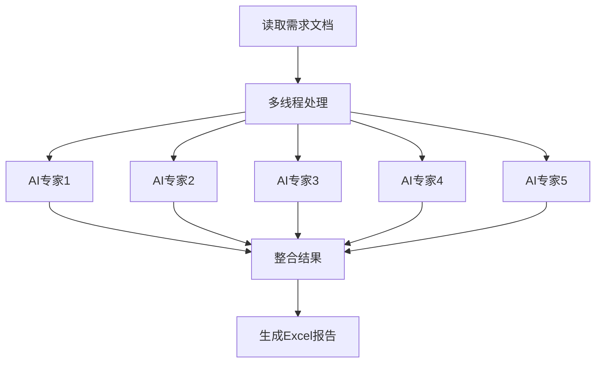

# 基于 Deepseek 的测试用例生成工具

## 项目简介

本项目是一个自动化测试用例生成系统，通过多线程技术和AI协作，能够自动从需求文档中提取信息，经由多位AI"专家"生成多样化的测试用例，并最终整理输出为Excel文件。

## 核心功能

- **多线程处理**：利用并发执行同时处理多个测试用例生成任务
- **AI专家协作**：通过5种不同的专家提示词(prompt)，从多角度生成测试用例
- **自动化Excel报告**：将所有生成的测试用例整理为结构化的Excel文档
- **全面的测试方法**：
  - 等价类划分法
  - 边界值分析法
  - 错误推测法
  - 因果图法
  - 场景测试法

## 系统架构



## 主要组件

### 1. 文档处理模块

- **函数**：`model.function.read_word`
- 功能：读取并解析输入的需求文档

### 2. 多线程执行模块

- **函数**：`model.mul_thread_function.multi_thread_function`
- 使用`concurrent.futures.ThreadPoolExecutor`实现并行处理
- 管理线程池，实现测试用例的并发生成

### 3. AI专家提示词

- **位置**：`model.expert_prompt.prompt_list`
- 包含5个专业化的提示词，代表不同的测试"专家"
- 每个提示词引导AI从不同角度生成测试用例

### 4. API集成模块

- **函数**：`API.ollama.generate_completion.stream_olama`
- 与Ollama API通信以生成测试用例
- 在流程中被调用两次：
  1. 使用专家提示词进行初始测试用例生成
  2. 使用`sys.prompt8`进行最终处理

### 5. Excel输出模块

- **函数**：`function.model.write_excel`
- 将JSON结果转换为pandas DataFrame
- 将结构化测试用例写入Excel文件

## 使用方法

1. 准备需求文档
2. 运行主执行流程：

   ```python
   from model.mul_thread_function import multi_thread_function
   results = multi_thread_function(requirements)
   ```

3. 系统将自动完成：
   - 读取并解析需求文档
   - 分发给多个AI专家进行分析
   - 整合所有生成的测试用例
   - 输出到Excel文件

## 测试方法学

系统采用多种测试技术确保全面覆盖：

1. **等价类划分**：将输入数据划分为等价类
2. **边界值分析**：专注于边界情况和边缘值
3. **错误推测**：预测可能的错误条件
4. **因果图法**：系统地映射因果关系
5. **场景测试**：创建真实使用场景

## 系统要求

- Python 3.8+
- pandas库
- concurrent.futures库
- Ollama API访问权限

## 安装指南

```bash
git clone https://github.com/your-repo/generate-test-cases-based-on-deepseek.git
```
